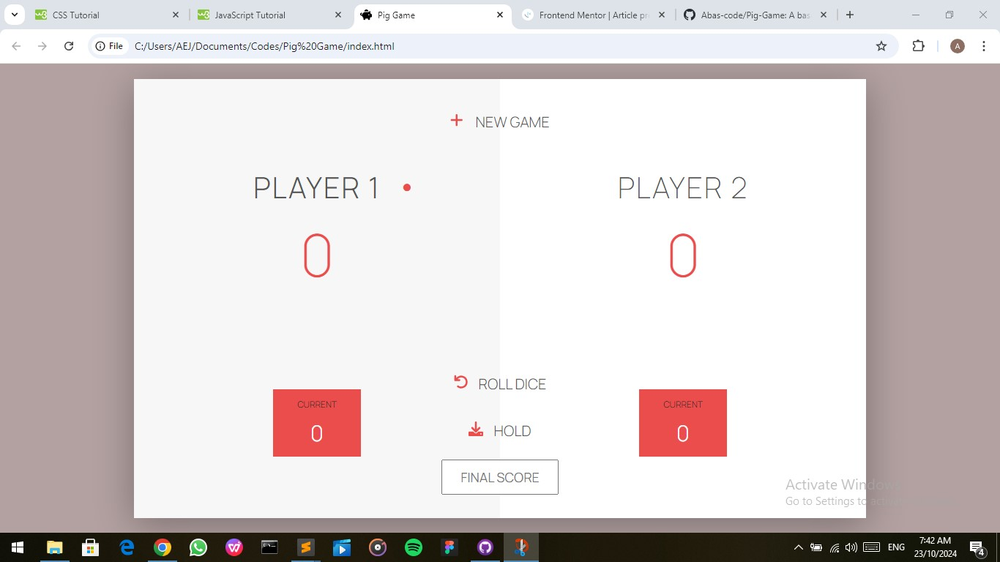

# Pig Game

## Table of contents

- [Overview](#overview)
  - [The challenge](#the-challenge)
  - [Screenshot](#screenshot)
  - [Links](#links)
- [My process](#my-process)
  - [Built with](#built-with)
  - [What I learned](#what-i-learned)
  - [Continued development](#continued-development)
  - [Useful resources](#useful-resources)
- [Author](#author)
- [Acknowledgments](#acknowledgments)


## Overview

### The challenge

Make a game with the following rules:
1. A player looses his ENTIRE score when he rolls two 6 in a row. After that, it's the next player's turn. (Hint: Always save the previous dice roll in a separate variable)
2. Add an input field to the HTML where players can set the winning score, so that they can change the predefined score of 100. (Hint: you can read that value with the .value property in JavaScript. This is a good oportunity to use google to figure this out :)
3. Add another dice to the game, so that there are two dices now. The player looses his current score when one of them is a 1. (Hint: you will need CSS to position the second dice, so take a look at the CSS code for the first one.)

### Screenshot



### Links

- Solution URL: (https://github.com/Abas-code/testimonials-grid-section-main)
- Live Site URL: (https://testimonials-grid-section-main-six-bay.vercel.app/)


## My process

### Built with

- Semantic HTML5 markup
- CSS custom properties
- Mobile-first workflow
- JavaScript

### What I learned

I learnt how to use svgs. I also learnt how to manipulate HTML elements in JavaScript.

```html
<svg xmlns="http://www.w3.org/2000/svg"  width="20" viewBox="0 0 512 512" fill="#EB4D4D">
  <path d="M432 256c0 17.69-14.33 32.01-32 32.01H256v144c0 17.69-14.33 31.99-32 31.99s-32-14.3-32-31.99v-144H48c-17.67 0-32-14.32-32-32.01s14.33-31.99 32-31.99H192v-144c0-17.69 14.33-32.01 32-32.01s32 14.32 32 32.01v144h144C417.7 224 432 238.3 432 256z"/>
</svg>
```
```js
document.querySelector('.btn-roll').addEventListener('click', function() {
  if(gamePlaying) {
    // 1. Random number
    var dice1 = Math.floor(Math.random() * 6) + 1;
    var dice2 = Math.floor(Math.random() * 6) + 1;

    //2. Display the result
    document.getElementById('dice-1').style.display = 'block';
    document.getElementById('dice-2').style.display = 'block';
    document.getElementById('dice-1').src = './assets/images/dice-' + dice1 + '.png';
    document.getElementById('dice-2').src = './assets/images/dice-' + dice2 + '.png';

    //3. Update the round score IF the rolled number was NOT a 1
    if (dice1 !== 1 && dice2 !== 1) {
      //Add score
      roundScore += dice1 + dice2;
      document.querySelector('#current-' + activePlayer).textContent = roundScore;
    } else {
      //Next player
      nextPlayer();
    }
  }    
});
```

### Continued development

I'm still learning how to use CSS Grid. JavaScript has been added to the mix.

### Useful resources

- [W3Schools](https://www.w3schools.com)


## Author

- Frontend Mentor - [@Abascode](https://www.frontendmentor.io/profile/Abascode)


## Acknowledgments

I want to acknowledge those who have been of great help to me from the Frontend community.